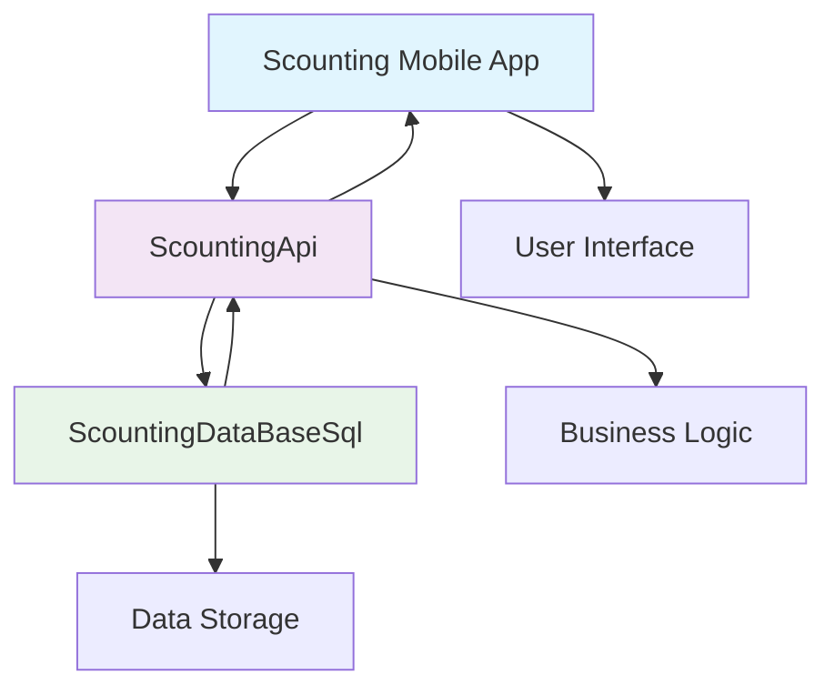

<!---
 Makedon Docs
 https://hackmd.io/5wgPxx1OTfaVDYUVeofRpQ
 https://forthebadge.com/#/
 https://sharifsuliman.medium.com/modern-github-badges-for-open-source-repositories-fb4dceeb368a
 https://naereen.github.io/badges/
 https://shields.io/
-->

# 🚀 OL-Sergio's Development Portfolio

[](https://developer.android.com/)
[](https://www.java.com/)


[](https://firebase.google.com/)
[](https://www.microsoft.com/en-us/sql-server/)


*A comprehensive collection of mobile applications and collaborative systems showcasing modern development practices*

---

</div>

## 📋 Table of Contents

- [🌟 Application Portfolio](#-application-portfolio)
- [🤝 Collaborative Systems](#-collaborative-systems)
- [🛠️ Technology Stack](#️-technology-stack)
- [🚀 Getting Started](#-getting-started)
- [📞 Contact ](#-contact)

---

## 🎯 Portfolio Overview

Welcome to my development portfolio! This repository showcases a diverse range of applications and systems, from ride-sharing platforms to collaborative scouting solutions. Each project demonstrates different aspects of modern mobile and web development.

### 🌟 Highlights
- **📱 Mobile Applications**: Native Android apps with modern UI/UX
- **🔥 Firebase Integration**: Real-time databases and authentication
- **🗺️ Location Services**: GPS tracking and mapping functionality
- **🤝 Collaborative Systems**: Integrated multi-service architectures
- **🎨 Visual Design**: Material Design and custom UI components


## 🌟 Application Portfolio

<div align="lefy">

*A diverse collection of applications showcasing different domains and technologies*

</div>

---

## 📱 Uber Clone

<div align="left">

### 🚗 Uber Clone - Ride Sharing Platform

*An Android application that replicates the core functionality of Uber, providing a platform for ride-sharing services with separate interfaces for passengers and drivers.*

[](https://github.com/OL-sergio/Uber_clone)

</div>

<summary><b>📱 Usage Guide</b></summary>

#### Getting Started
1. **Launch the app** and choose your role (Passenger or Driver)
2. **Create an account** or login with existing credentials
3. **Grant location permissions** when prompted

#### As a Passenger
1. Set your pickup location (current location by default)
2. Enter your destination
3. Request a ride by tapping "Chamar Uber"
4. Wait for a driver to accept your request
5. Track your driver's location in real-time
6. Complete the trip and view payment details

#### As a Driver
1. Wait for ride requests in the "RequestsActivity"
2. View incoming requests with passenger details
3. Accept a ride request
4. Navigate to the passenger's location
5. Pick up the passenger and navigate to the destination
6. Complete the trip and process payment

---


### 🍕 iFood Clone
> **Food Delivery Platform**

[](https://github.com/OL-sergio/iFood_clone)
[](https://developer.android.com/)

A comprehensive food delivery application inspired by iFood, featuring restaurant listings, menu browsing, order management, and real-time delivery tracking.

**Key Features:**
- 🍽️ Restaurant discovery and browsing
- 📱 Interactive menu with customisation options
- 🛒 Shopping cart and order management


---

### 🌤️ YupWeather
> **Weather Forecast Application**

[](https://github.com/OL-sergio/YupWeather)
[](https://openweathermap.org/)

A beautiful weather application providing accurate forecasts with an intuitive interface and location-based weather updates.

**Key Features:**
- 🌡️ Current weather conditions and forecasts
- 📍 Location-based detection
- 📊 Weather charts

---

### 💬 Instagram-clone
> **Social Media Chat Platform**

[](https://github.com/OL-sergio/Instagram-clone)

An Instagram-inspired social chat application with photo sharing, real-time messaging, and social networking features.

**Key Features:**
- 📸 Photo sharing with filters and effects
- 💬 Real-time messaging and chat rooms
- 👥 User profiles and social connections
- ❤️ Like, comment
- 📱 Stories and status updates

---

### 🐦 Flappybird
> **Classic Game Implementation**

[](https://github.com/OL-sergio/FlappyBird_clone)
[](https://developer.android.com/games)

A classic Flappy Bird game implementation with smooth animations, scoring system, and engaging gameplay mechanics.

**Key Features:**
- 🎮 Intuitive tap-to-fly controls
- 🏆 High score tracking and leaderboards
- 🎵 Sound effects and background music
- 🌈 Colorful graphics and animations
- 📊 Game statistics and achievements

---

### ✅ Tasks
> **Task Management Application**

[](https://github.com/OL-sergio/Tasks)
[](https://todoist.com/)

A comprehensive task management application for organizing daily activities, setting reminders, and tracking productivity.

**Key Features:**
- ✏️ Create, edit, and organize task
- 🔔 Smart notifications and reminders
- 🏷️ Categories and priority management

---

### 🏥 MedUtent
> **Medical Utility Application**

[](https://github.com/OL-sergio/MedUtent)
[](https://www.who.int/)

A medical utility application providing health tracking, medication reminders, and medical information management.

**Key Features:**
- 📋 Health records and history
- 🏥 Doctor appointments scheduling

### 🛒 OLX Clone
> **Marketplace Platform**

[](https://github.com/OL-sergio/OLX-clone)

A marketplace application inspired by OLX, enabling users to buy and sell products with advanced search and filtering capabilities.

**Key Features:**
- 🏪 Product listings and browsing
- 🔍 Advanced search and filters
- 💬 In-app messaging system
- 📸 Photo upload and gallery

---

## 🤝 Collaborative Systems

<div align="center">

*Integrated multi-service architecture for comprehensive scouting solutions*

</div>

### 🔍 Scouting Ecosystem

A comprehensive scouting platform consisting of three interconnected applications working together to provide a complete solution for talent identification and management.

<div align="center">



</div>

#### 📱 Scouting  [](https://github.com/OL-sergio/Scouting)
> **Main Scouting Application**

[](https://github.com/OL-sergio/Scouting)

The primary mobile application providing intuitive interfaces for scouts, coaches, and administrators to manage talent identification processes.

**Key Features:**
- 👥 Scout and player profile management
- 📱 Real-time data synchronization

---

#### 🌐 ScoutingApi
> **REST API Service**

[](https://github.com/OL-sergio/ScoutingApi)

A robust REST API service handling all business logic, authentication, and data processing for the scouting ecosystem.

**Key Features:**
- 🔐 Secure authentication and authorization
- 📡 RESTful API endpoints
- 🔄 Real-time data processing
- 📊 Analytics and reporting engine
- 🛡️ Data validation and security

---

#### 🗄️ ScoutingDataBaseSql
> **Database Layer**

[](https://github.com/OL-sergio/ScoutingDataBaseSql)
[](https://www.microsoft.com/en-us/sql-server/)

Comprehensive database design and management system providing optimized data storage and retrieval for the scouting platform.

**Key Features:**
- 🗃️ Optimized database schema design
- 📈 Performance tuning and indexing
- 🔄 Data migration and versioning
- 🛡️ Backup and recovery procedures
- 📊 Database analytics and monitoring

### 🔗 System Integration

The three applications work seamlessly together:

1. **Scouting** provides the user interface and mobile experience
2. **ScoutingApi** handles all business logic and API communication
3. **ScoutingDataBaseSql** manages data persistence and retrieval

This architecture ensures scalability, maintainability, and optimal performance across the entire scouting ecosystem.

---

## 🛠️ Technology Stack

<div align="center">

*Technologies and frameworks used across the portfolio*

</div>

### 📱 Mobile Development


### 🔥 Backend & Cloud


### 🗄️ Database


### 🎨 UI/UX


### 🌐 APIs & Services


###    Version Control 


---

## 🚀 Getting Started

### 📋 Prerequisites

Before running any application, ensure you have:

- **Android Studio** (latest version)
- **Java 8+** or **Kotlin** support
- **Google Maps API Key** (for location-based apps)
- **Firebase Project** with required services
- **Android SDK** (minimum API level varies by project)

### 🔧 Quick Setup

1. **Clone any repository:**
   ```bash
   git clone https://github.com/OL-sergio/[repository-name].git
   cd [repository-name]
   ```

2. **Configure Firebase:**
   - Create Firebase project
   - Download `google-services.json`
   - Place in `app/` directory

3. **Setup API Keys:**
   - Configure required API keys in `AndroidManifest.xml`
   - Update configuration files as needed

4. **Build and Run:**
   ```bash
   ./gradlew build
   ./gradlew installDebug
   ```

### 📚 Detailed Setup

Each repository contains specific setup instructions in its individual README file. Please refer to the respective documentation for detailed configuration steps.

---

## 📞 Contact 

<div align="center">

### 👨‍💻 OL-Sergio

[](https://github.com/OL-sergio)
[](https://drive.google.com/drive/folders/1-SS5XW_qQgPNBl8mXvhhONFKOceneOjF)
[](mailto:a18074@alunos.ipca.pt)
[](https://www.linkedin.com/in/sergio-dev-android-junior/)


*Passionate mobile developer creating innovative solutions*

</div>

### 🤝 Contributing

Contributions are welcome across all projects! Please feel free to:

- 🐛 Report bugs and issues
- 💡 Suggest new features
- 🔀 Submit pull requests
- ⭐ Star repositories you find useful

### 📄 License

Individual projects may have different licenses. Please check each repository for specific license information.

### 🔒 Security Note

⚠️ **Important**: All API keys shown in public repositories are examples only. Replace with your own keys for production use.

---
